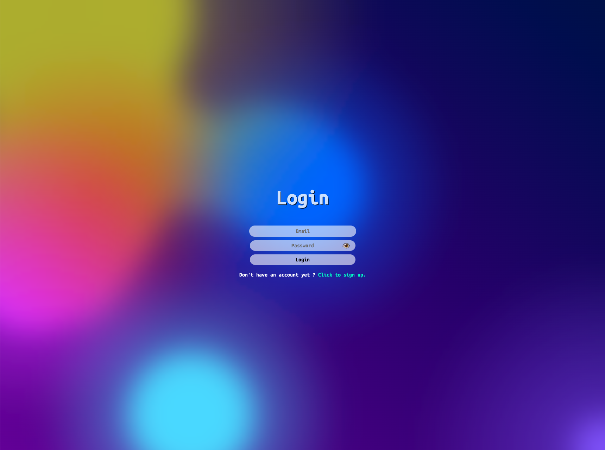
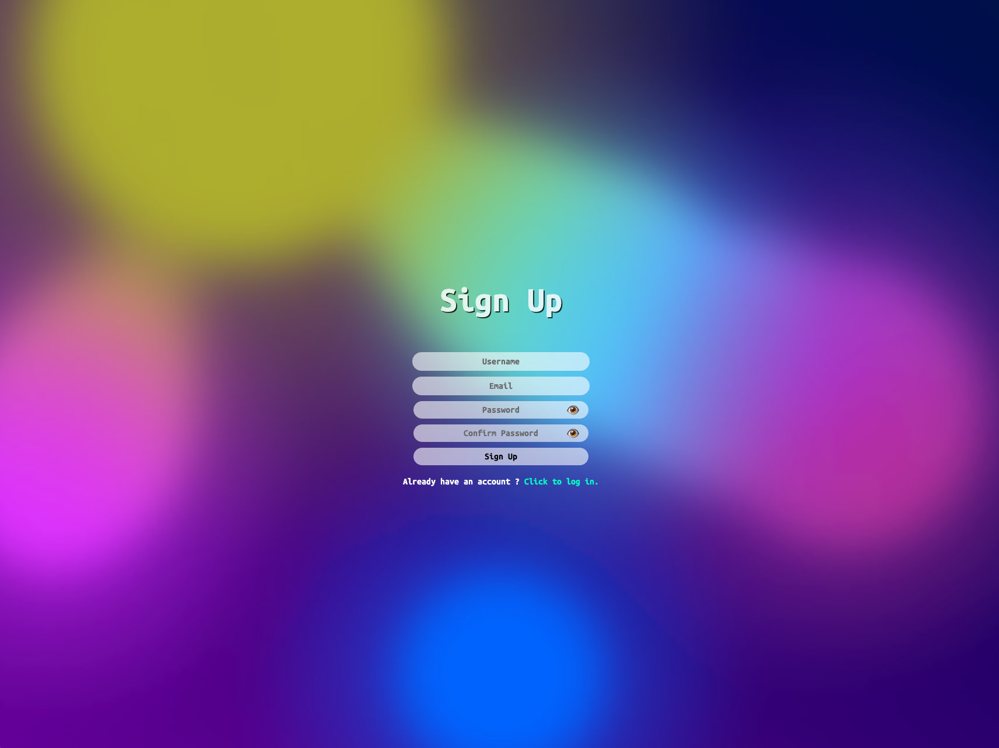

# Login_System

**Login_System** 是一個基於 **MongoDB、Express、React 和 Node.js**（MERN Stack）構建的使用者登入系統，支援用戶註冊、登入、登出與身份驗證。該專案透過 **JWT（JSON Web Token）** 確保登入安全性，並整合 **MongoDB** 進行數據存儲，適合作為 MERN 技術棧的學習與實踐專案。

---

## **功能特色**

### **用戶管理**

- **用戶註冊**：使用者可以透過表單創建帳號，並驗證輸入的電子郵件與密碼。
- **用戶登入/登出**：透過 JWT（JSON Web Token）進行身份驗證，確保用戶資訊安全。
- **密碼加密**：使用 **bcrypt** 進行密碼雜湊，確保儲存於資料庫中的密碼安全性。
- **身份驗證**：每次登入後，後端會產生 **JWT Token**，用戶可利用該 Token 進行 API 請求。
- **錯誤提示**：針對輸入錯誤（如密碼不匹配、必填欄位遺漏）顯示適當錯誤訊息。

### **前端技術（React）**

- **動態表單驗證**：使用 React 處理表單輸入，提供即時驗證功能。
- **狀態管理**：使用 React Hooks（useState、useEffect）管理用戶登入狀態。
- **API 串接**：透過 Axios 與後端 API 進行資料交換。
- **受保護頁面（Dashboard）**：登入後才可訪問，未登入則自動導向首頁。
- **視覺特效**：使用 **SVG + CSS Gradient 動畫** 讓登入頁面更具吸引力。

### **後端技術（Node.js + Express）**

- **RESTful API**：提供用戶註冊、登入、登出與用戶資訊 API。
- **身份驗證**：使用 JWT 進行 Token 驗證，保證 API 安全性。
- **MongoDB 整合**：使用 **Mongoose** 操作資料庫。
- **CORS 支援**：允許前後端跨來源請求，確保正常通信。

---

## **技術細節**

- **後端框架**：Node.js + Express
- **前端框架**：React.js + React Router
- **資料庫**：MongoDB（使用 Mongoose 進行 ODM 操作）
- **身份驗證**：JWT（JSON Web Token）
- **密碼加密**：bcrypt.js
- **HTTP 請求**：Axios
- **日誌記錄**：morgan
- **前端樣式**：CSS + SVG 動畫

---

## **擴展功能與未來計劃**

- **密碼重設**：透過 Email 讓用戶重設密碼。
- **OAuth 第三方登入**：支援 Google、Facebook 登入。
- **個人資料管理**：允許用戶修改 Email、密碼、頭像等資訊。
- **角色權限管理**：區分一般使用者與管理員權限。
- **API 擴展**：使用 GraphQL 或 WebSocket 進行即時通訊。
- **更佳的 UI/UX**：整合 Tailwind CSS 或 Material-UI。
- **前後端完全分離**：讓 API 可支援多種應用（如行動裝置 App）。
- **測試覆蓋**：加入單元測試與整合測試，確保系統穩定性。
- **安全性提升**：加入雙重驗證（2FA）與 CSRF 保護。

